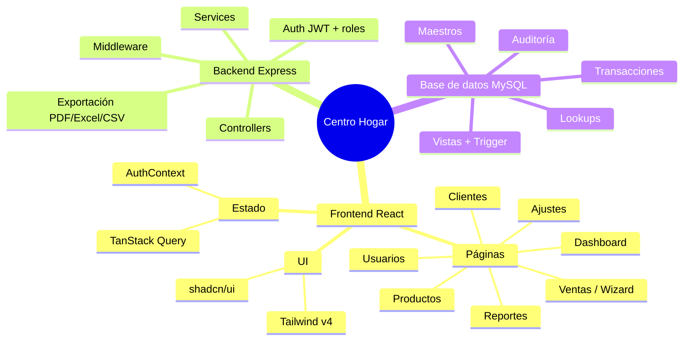
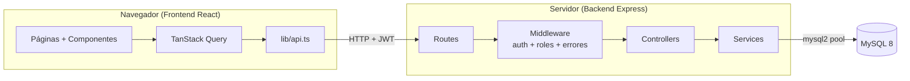
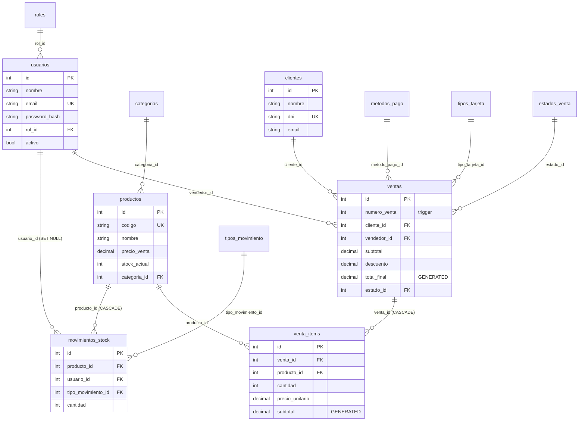
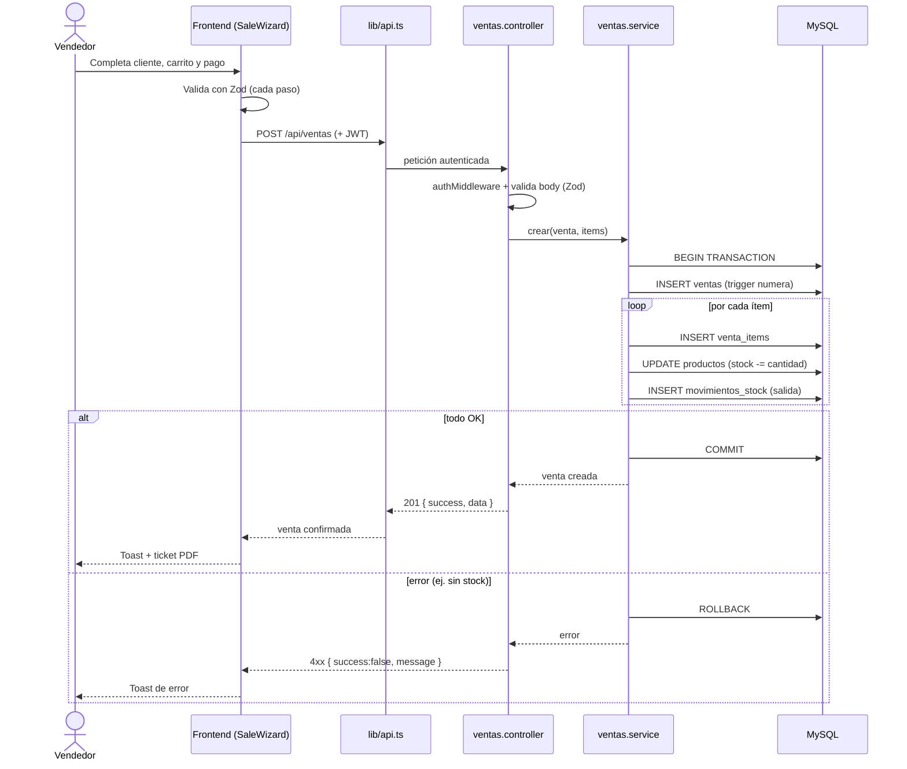

# Centro Hogar — Documentación del Proyecto

> Documento de presentación académica. Explica **qué es** el sistema, **cómo está
> organizado el código** y **cómo fluyen los datos** de punta a punta.
> Los diagramas están en formato Mermaid: GitHub y VS Code los renderizan
> automáticamente.

---

## 1. Resumen ejecutivo

**Centro Hogar** es un panel de gestión web para una mueblería. Permite
administrar **clientes, productos, ventas, reportes y usuarios** desde una
interfaz moderna, con control de stock automático y exportación de datos.

Es una aplicación **full-stack** dividida en dos proyectos dentro de un mismo
repositorio (monorepo):

| Proyecto | Rol | Tecnología principal |
|----------|-----|----------------------|
| `centro-hogar/` | Frontend (lo que ve el usuario) | React 19 + Vite + TypeScript |
| `backend/` | API REST (lógica + datos) | Node.js + Express + TypeScript |
| `database.sql` | Base de datos | MySQL 8 |

Características destacadas:

- **Autenticación con JWT** y **3 roles** (administrador, encargado de stock,
  vendedor) con permisos diferenciados.
- **Registro de ventas transaccional**: una venta descuenta stock y registra
  movimientos de inventario de forma atómica (todo o nada).
- **Reportes y backups** exportables a **PDF, Excel y CSV**.
- **Base de datos normalizada (3FN)** con columnas calculadas, índices,
  vistas y un trigger para la numeración de ventas.

---

## 2. Mapa mental



---

## 3. Arquitectura general

El sistema sigue una arquitectura clásica de **3 capas**: el navegador habla
con la API REST, y la API es la única que accede a la base de datos.



**Idea clave:** el frontend nunca toca la base de datos. Toda la lógica de
negocio y validación vive en el backend; el frontend solo presenta datos y
captura acciones del usuario.

### Stack tecnológico (versiones reales)

**Frontend (`centro-hogar/`)**

| Capa | Tecnología | Versión |
|------|-----------|---------|
| Framework | React | 19 |
| Bundler | Vite | 8 |
| Lenguaje | TypeScript | 5.9 |
| Routing | React Router DOM | 7 |
| Estado de servidor | TanStack Query | 5 |
| Formularios | React Hook Form + Zod | 7 / 4 |
| UI | shadcn/ui + Base UI + Radix Select | — |
| Estilos | Tailwind CSS | 4 |
| Gráficos | Recharts | 3 |
| PDF | @react-pdf/renderer | 4 |
| Notificaciones | Sonner | 2 |

**Backend (`backend/`)**

| Capa | Tecnología | Versión |
|------|-----------|---------|
| Runtime | Node.js | 18+ |
| Framework | Express | 4 |
| Lenguaje | TypeScript | 5.5 |
| Base de datos | MySQL (driver `mysql2`) | 8 / 3.10 |
| Autenticación | jsonwebtoken + bcryptjs | 9 / 2.4 |
| Validación | Zod | 3 |
| Seguridad | helmet + cors + express-rate-limit | 7 / 2.8 / 7 |
| Exportación | exceljs + xlsx + jszip | 4.4 / 0.18 / 3.10 |

---

## 4. Backend (API REST)

### Estructura de carpetas (`backend/src/`)

```
backend/src/
├── index.ts            # Arranque del servidor
├── app.ts              # Configuración Express (helmet, cors, rate-limit)
├── config/
│   ├── database.ts     # Pool de conexiones MySQL (mysql2/promise)
│   └── env.ts          # Carga y valida variables de entorno
├── controllers/        # Orquestan la petición (validan y delegan)
├── services/           # Lógica de negocio + acceso a la base
├── routes/             # Definición de endpoints (index.ts registra todo)
├── middleware/         # auth (JWT), roles (permisos), error handler
├── models/             # Tipos TypeScript del dominio
└── utils/              # jwt, password, response, pagination, asyncHandler
```

### Patrón de capas

Cada petición atraviesa siempre el mismo recorrido:

`Route → Middleware → Controller → Service → MySQL`

- **Controller**: solo orquesta. Valida el body con **Zod** y delega.
- **Service**: contiene la lógica de negocio y las consultas SQL.
- **`utils/response.ts`**: toda respuesta sale con la forma estándar
  `{ success, data?, message? }` mediante helpers (`r.ok()`, `r.badRequest()`,
  `r.notFound()`, etc.).

### Endpoints (registrados en `routes/index.ts`)

| Prefijo | Módulo | Función |
|---------|--------|---------|
| `/api/auth` | Autenticación | login, perfil, cambio de contraseña |
| `/api/usuarios` | Usuarios | CRUD de usuarios del sistema |
| `/api/categorias` | Categorías | CRUD de categorías de productos |
| `/api/productos` | Productos | CRUD, stock, top vendidos, bajo stock |
| `/api/clientes` | Clientes | CRUD + historial de compras |
| `/api/ventas` | Ventas | registrar, listar, cancelar, estadísticas |
| `/api/reportes` | Reportes | KPIs por período, exportación PDF/Excel |
| `/api/reportes/backup` | Backup | exportación completa CSV / Excel |
| `/api/admin` | Admin | tareas administrativas (ej. limpieza de ventas) |

### Autenticación y roles

1. El usuario envía email + contraseña a `POST /api/auth/login`.
2. El backend valida contra `usuarios.password_hash` (bcrypt) y devuelve un
   **JWT** firmado.
3. El frontend guarda el token y lo envía en cada petición
   (`Authorization: Bearer <token>`).
4. `authMiddleware` verifica el token; los aliases `soloAdmin` y `adminOStock`
   (definidos en `middleware/roles.middleware.ts`) restringen por rol.

| Sección | admin | encargado_stock | vendedor |
|---------|-------|-----------------|----------|
| Dashboard | ✓ | ✓ | ✓ |
| Clientes | lectura + escritura | lectura | lectura |
| Productos | lectura + escritura | lectura + escritura | lectura |
| Ventas | todas | todas | solo propias |
| Reportes | ✓ | ✓ | — |
| Usuarios | ✓ | — | — |
| Ajustes | ✓ | ✓ | — |

### Seguridad y manejo de errores

- **helmet** (cabeceras seguras), **CORS** restringido al frontend,
  **rate-limit** global y reforzado en el login (anti fuerza bruta).
- El `error.middleware.ts` traduce errores de MySQL a códigos HTTP claros
  (ej. `ER_DUP_ENTRY` → 409 Conflict con mensaje específico).

---

## 5. Frontend (SPA React)

### Estructura de carpetas (`centro-hogar/src/`)

```
centro-hogar/src/
├── main.tsx            # Punto de entrada
├── app/
│   ├── App.tsx         # Providers (Query, Auth, Toaster)
│   ├── Router.tsx      # Rutas con lazy loading + guards
│   └── providers/      # AuthProvider, QueryProvider
├── pages/              # Una página por ruta (DashboardPage, VentasPage…)
├── features/           # Un folder por dominio (servicios + componentes)
├── components/
│   ├── common/         # DataTable, PageHeader, ConfirmDialog…
│   ├── layout/         # AppLayout, AppHeader, AppSidebar
│   └── ui/             # Componentes shadcn/ui
├── hooks/              # usePermissions, useDebounce…
├── lib/
│   ├── api.ts          # Cliente HTTP centralizado (fetch + JWT)
│   ├── utils.ts        # Helpers (cn, cálculos de totales)
│   └── validations/    # Esquemas Zod (venta, producto, cliente)
└── types/app.types.ts  # Tipos del dominio
```

### Conceptos clave

- **Estado de servidor con TanStack Query**: `useQuery` para lecturas (con
  caché y refetch automático) y `useMutation` para escrituras.
- **Cliente API único** (`lib/api.ts`): agrega el JWT a cada request y maneja
  el 401 (sesión expirada) de forma centralizada.
- **Guards de ruta**: `RequireAuth`, `RedirectIfAuth` y `RequirePermission`
  protegen las páginas según el estado de autenticación y el rol.
- **`SaleWizard`**: el registro de una venta es un asistente de **4 pasos**
  (cliente → carrito → pago → confirmación) con validación Zod en cada paso.
- **Exportaciones**: tickets y reportes en PDF (`@react-pdf/renderer`) y
  backups en Excel/CSV descargados desde la API.

---

## 6. Modelo de datos (MySQL)

12 tablas organizadas en 4 grupos. Está en **Tercera Forma Normal**: los
catálogos se normalizan en tablas *lookup* y los totales son columnas
**`GENERATED`** (se calculan solas, no se insertan).



| Grupo | Tablas |
|-------|--------|
| **Lookups** (catálogos) | `roles`, `metodos_pago`, `tipos_tarjeta`, `estados_venta`, `tipos_movimiento` |
| **Maestros** | `usuarios`, `clientes`, `categorias`, `productos` |
| **Transacciones** | `ventas`, `venta_items` |
| **Auditoría** | `movimientos_stock` |

Detalles de diseño (definidos en `database.sql`):

- **Columnas `GENERATED STORED`**: `ventas.total_final` = `subtotal - descuento
  + interes_monto`; `venta_items.subtotal` = `cantidad * precio_unitario`.
- **Trigger** `trg_ventas_numero_venta`: numera las ventas automáticamente
  antes de insertarlas.
- **Índices** estratégicos para reportes (ej. estado + fecha de venta) y
  **FULLTEXT** en `clientes` y `productos` para búsqueda de texto libre.
- **Vistas**: `v_ventas`, `v_productos`, `v_movimientos_stock` resuelven los
  JOINs comunes.
- Borrado en cascada: al borrar una venta caen sus `venta_items`; los
  `movimientos_stock` conservan el historial.

---

## 7. Flujo end-to-end: registrar una venta

Ejemplo del recorrido completo cuando un vendedor confirma una venta en el
asistente. Lo importante es que **el descuento de stock y la venta son
atómicos**: se hace todo dentro de una transacción (`COMMIT` / `ROLLBACK`).



---

## 8. Cómo levantar el proyecto

Requisitos: **Node.js 18+** y **MySQL 8** (con phpMyAdmin, vía XAMPP/WAMP/Laragon).

```bash
# 1. Base de datos (Windows / PowerShell)
cd scripts
.\instalar-base-de-datos.ps1          # crea estructura + datos de prueba
# .\instalar-base-de-datos.ps1 -SoloEstructura   # base vacía

# 2. Backend
cd backend
cp .env.example .env                  # editar credenciales MySQL + JWT_SECRET
npm install
npm run dev                           # http://localhost:3001

# 3. Frontend (otra terminal)
cd centro-hogar
cp .env.example .env                  # VITE_API_URL=http://localhost:3001/api
npm install
npm run dev                           # http://localhost:5173
```

Credenciales de prueba (solo si se importó `seed.sql`):

| Email | Contraseña | Rol |
|-------|------------|-----|
| `admin@centrohogar.com` | `test123` | Administrador |
| `elena.correa@centrohogar.com` | `test123` | Encargado de stock |
| `lucas.garcia@centrohogar.com` | `test123` | Vendedor |

> Más detalle de instalación y variables de entorno en el [`README.md`](README.md).

---

## 9. Decisiones de diseño e historia del proyecto

El proyecto **evolucionó** a lo largo del desarrollo:

1. **Etapas iniciales**: se probaron servicios *Backend-as-a-Service* (un SDK
   tipo BaaS y, más adelante, Supabase/Google Sheets) para resolver datos y
   autenticación rápido.
2. **Decisión final**: migrar a un **backend propio Express + MySQL**.

Motivos de la migración:

- **Control total del modelo de datos**: poder diseñar el esquema relacional,
  los índices, vistas y triggers — un objetivo central del trabajo académico
  (modelar correctamente la base es parte de la evaluación).
- **Sin dependencia de terceros**: la app funciona 100% local, sin cuentas
  externas ni límites de plan, lo que facilita instalarla y defenderla.
- **Lógica de negocio explícita**: las reglas (transacción de venta, control
  de stock, permisos por rol) quedan en código revisable, no ocultas en un
  servicio externo.

Las integraciones viejas (BaaS, Supabase, Google Sheets) fueron **eliminadas
por completo del código**; este documento describe únicamente la arquitectura
vigente.
